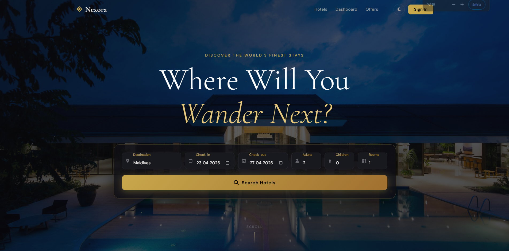
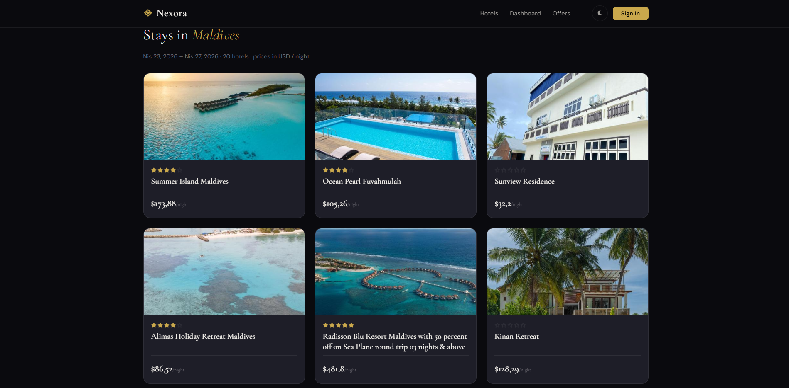
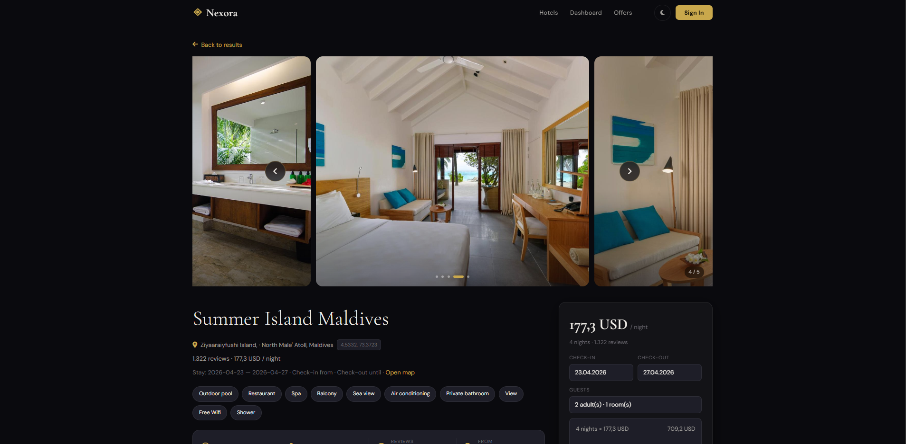
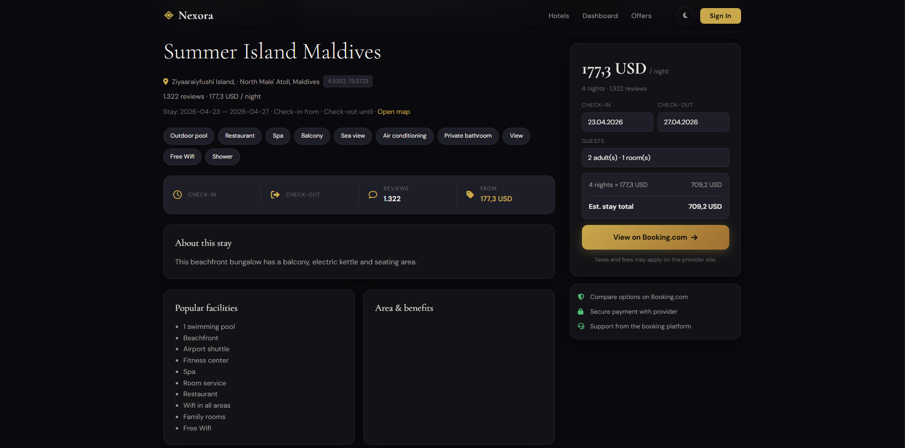
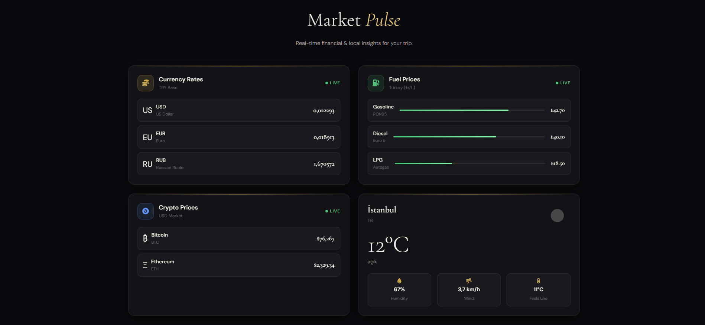

## ✈️ Nexora

---

## 📋 Proje Hakkında

Nexora, farklı kaynaklardan güncel verileri tek bir platformda sunmayı hedefleyen bir ASP.NET Core web uygulamasıdır. Uygulama, veriyi doğrudan üretmek yerine RapidAPI üzerinden sunulan harici REST servislerini kullanarak; döviz kurları, kripto para bilgileri, hava durumu, yakıt fiyatları ve otel verileri gibi dinamik içerikleri anlık olarak elde eder.

Tüm API entegrasyonları, tek bir RapidAPI anahtarı üzerinden HttpClient ile yönetilir. Alınan JSON verileri işlenerek servis katmanında yapılandırılır ve MVC / Razor tabanlı kullanıcı arayüzünde sade ve anlaşılır bir şekilde sunulur.

Bu proje, .NET ekosisteminde harici API’lerle çalışmanın, veri tüketimini merkezi bir yapıda yönetmenin ve farklı veri kaynaklarını tek bir uygulamada birleştirmenin pratik bir örneğini ortaya koymaktadır.

---

## 🖼️ Ekran Görüntüleri

### 🏠 Kullanıcı Arayüzü

  
  
  
  
  

